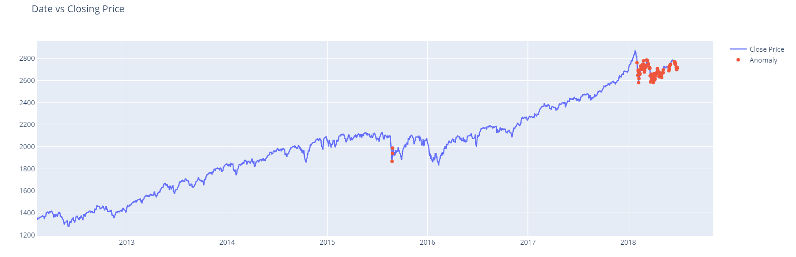

# Anomaly Detection in Time Series Data
This is an anomaly detection model using deep learning. I have designed and trained an LSTM autoencoder using the Keras API with Tensorflow 2 as the backend to detect anomalies (sudden price changes) in the S&P 500 index.I have also created interactive charts and plots using Plotly Python and Seaborn for data visualization and display our results in Jupyter notebooks.

# Background
## What is Autoencoder?
> An autoencoder is a type of artificial neural network used to learn efficient data codings in an unsupervised manner. The aim of an autoencoder is to learn a representation (encoding) for a set of data, typically for dimensionality reduction, by training the network to ignore signal “noise”.
[Source](https://en.wikipedia.org/wiki/Autoencoder#:~:text=An%20autoencoder%20is%20a%20type,to%20ignore%20signal%20%E2%80%9Cnoise%E2%80%9D)

## What is LSTM?
> Long short-term memory is an artificial recurrent neural network architecture used in the field of deep learning. Unlike standard feedforward neural networks, LSTM has feedback connections. It can not only process single data points, but also entire sequences of data. 
[Source](https://en.wikipedia.org/wiki/Long_short-term_memory)

## What is anomaly detection?
> In data mining, anomaly detection is the identification of rare items, events or observations which raise suspicions by differing significantly from the majority of the data.
[Source](https://en.wikipedia.org/wiki/Anomaly_detection)

## What is LSTM Autoencoder?
> The Encoder-Decoder LSTM is a recurrent neural network designed to address sequence-to-sequence problems, sometimes called seq2seq. This architecture is comprised of two models: one for reading the input sequence and encoding it into a fixed-length vector, and a second for decoding the fixed-length vector and outputting the predicted sequence. The use of the models in concert gives the architecture its name of Encoder-Decoder LSTM designed specifically for seq2seq problems.
[Source](https://machinelearningmastery.com/encoder-decoder-long-short-term-memory-networks/#:~:text=The%20Encoder%2DDecoder%20LSTM%20is,sequence%20problems%2C%20sometimes%20called%20seq2seq.&text=The%20challenge%20of%20sequence%2Dto,it%20was%20designed%20to%20address)
# Data used to train the model
> [S&P500 Daily Prices 1986 - 2018](https://www.kaggle.com/pdquant/sp500-daily-19862018)

# Results

# Note
> Download the python notebook and given data set and run the code in jupyter-notebook or Google Colab to experiance the interactive plots.
